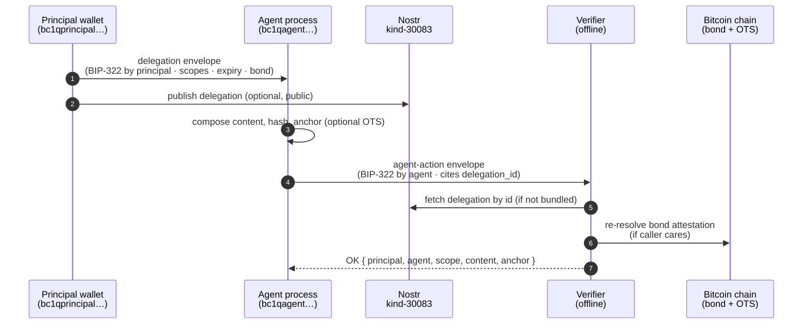
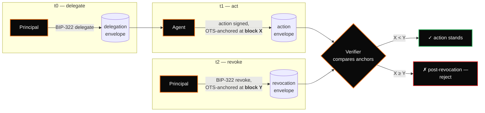

export const metadata = {
    title: 'Protocol walkthrough — OC Agent',
    description:
        'How delegations, agent-actions, and revocations flow through the OrangeCheck stack.',
};

# Protocol walkthrough

A tour of the three envelopes, two typical flows, and how they compose with the
rest of the OrangeCheck stack. For the normative rules see the
[specification](/agent/spec).

## Three envelopes

OC Agent defines three envelope kinds. All three share the canonical-message /
BIP-322 / Nostr publication discipline of the rest of the OrangeCheck stack.

| Envelope         | `kind`             | Nostr kind                     | Purpose                                      |
| ---------------- | ------------------ | ------------------------------ | -------------------------------------------- |
| **Delegation**   | `agent-delegation` | 30083                          | Principal grants the agent scoped authority. |
| **Agent-action** | `agent-action`     | 30084 _(shared with OC Stamp)_ | Agent exercises the delegation.              |
| **Revocation**   | `agent-revocation` | 30085                          | Principal (or agent) burns the delegation.   |

Each envelope is independently verifiable:

- A **delegation** is authentic iff its BIP-322 signature verifies under the
  principal's address.
- An **agent-action** is authentic iff (a) its BIP-322 signature verifies under
  the agent's address, (b) the referenced delegation verifies, and (c) the
  exercised scope is within the granted scope set.
- A **revocation** is authentic iff its BIP-322 signature verifies under the
  principal's address (or, if the delegation granted it, the agent's).

## Delegation — the grant

A delegation is a statement from a principal's Bitcoin address:

> I, `bc1qprincipal…`, authorize `bc1qagent…` to perform actions matching scope
> set S, bonded at 500,000 sats × 180 days under my OrangeCheck attestation,
> until Friday 2026-04-29T12:00Z.

That statement is serialized into a canonical message, hashed to produce an id,
signed via BIP-322 by the principal, and written into a JSON envelope. The
envelope travels over any medium that can carry bytes.

Scopes are not sentences — they are declarative strings like
`lock:seal(recipient=bc1qalice)` or `ln:send(max_sats<=1000,node=03abc…)`.
Structured, human-legible, deterministically comparable. See the
[scope grammar](/agent/scopes).

## Agent-action — the exercise

An agent-action is structurally **identical to an
[OC Stamp](https://stamp.ochk.io) envelope** except for a different preamble
(`oc-agent:action:v1`) and two extra lines in the canonical message:

```
oc-agent:action:v1
address: bc1qagent…
content_hash: sha256:deadbeef…
content_length: 4096
content_mime: application/vnd.oc-lock+json
signed_at: 2026-04-22T12:05:00Z
delegation_id: <64-hex of the delegation envelope's id>
scope_exercised: lock:seal(recipient=bc1qalice)
```

The action commits to what the agent did (`content.hash`), when (`signed_at`
plus optional OTS anchor), which delegation authorized it (`delegation_id`), and
which granted scope it exercised (`scope_exercised`). A stamp verifier that
ignores the two extra fields still confirms authorship and priority correctly —
authority verification is additive.

## Revocation — the burn

If the principal loses trust in the agent, or the agent's key is compromised, or
the job simply concludes early, a revocation kills the delegation:

```
oc-agent:revocation:v1
address: bc1qprincipal…
delegation_id: <64-hex>
reason: agent key rotated
signed_at: 2026-04-22T14:00:00Z
```

Revocations are OTS-anchored when possible, so their effective time is provable
against a specific Bitcoin block — which matters when an action and a revocation
race on the same day and a third party has to decide which was first.

## Flow 1 — delegate, act, verify



1. Principal picks scopes.
2. Principal's wallet opens a signing prompt containing the canonical delegation
   message. Principal reviews (scopes, expiry, bond) and signs.
3. Signed envelope is delivered to the agent over any transport.
4. Agent stores the delegation. Optionally the principal publishes Nostr
   kind-30083.
5. Agent composes its action, hashes content, signs the canonical action
   message, produces an `.action` envelope. Optionally anchors to OTS.
6. Verifier runs the algorithm in §SPEC 8 — purely locally, against envelope +
   Bitcoin headers.

## Flow 2 — revocation and priority



The verifier compares the action's OTS anchor block to the revocation's. If the
action predates the revocation, it stands. If the action isn't OTS-anchored but
a revocation exists that predates its declared `signed_at`, the verifier treats
the action as suspect — the agent's "I signed this before you revoked" claim is
not provable against Bitcoin.

This is why OC Agent **strongly recommends OTS anchoring** of actions whose
authority might later be disputed.

## Composing with the rest of the stack

### With OC Lock

If a delegation's scopes would reveal sensitive intent, wrap the delegation
envelope with [OC Lock](https://lock.ochk.io) to the agent's device key. The
confidentiality is additive; the authority verification is unchanged.

### With OC Stamp

Every agent-action **is** an OC Stamp with two extra lines. A verifier with only
a stamp implementation reads authorship + priority correctly; only the authority
check requires OC Agent awareness.

### With OC Vote

A principal may delegate `vote:cast(poll_id=<hex>, choice=yes)` to an agent. The
agent produces an agent-action whose content is an OC Vote envelope. Verifiers
see the agent cast the vote, backed by a delegation, backed by the principal's
bond.

### With OrangeCheck

`bond.attestation_id` points to an OrangeCheck canonical message signed by the
principal. Verifiers re-resolve it against current chain state — the bond is a
live signal, not a stored number.

### With MCP, Nostr, Lightning

Any downstream transport gets a companion authority artifact:

- **MCP**: an `agent-action(kind=30084)` stamping the tool-invocation arguments
  as content.
- **Nostr posts**: a companion kind-30084 event linked to the underlying kind-1
  post id.
- **Lightning**: a stamp whose content is the payment hash.

## Design constants

1. Bitcoin address is identity, end of story.
2. BIP-322 on a hex id is the signature.
3. Verification is a pure function of envelopes + (optional) Nostr + Bitcoin
   headers.
4. Every envelope is a single JSON object.
5. Scope strings are parseable, comparable, composable.
6. Revocation is always available, always citable — priority-ordered by OTS
   anchor.
7. Stake is optional but first-class.

For the full normative rules, see [SPEC](/agent/spec). For the rationale behind
the design, see [why](/agent/why).
