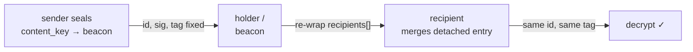

export const metadata = {
    title: 'Envelope & content addressing · OC Chat',
    description:
        'The two envelope kinds OC Chat adds to OC Lock, and the one cryptographic rule that differs — the recipient-exclusion id/AAD rule that lets a held envelope be re-keyed after the fact without breaking the signature or the ciphertext tag.',
};

# Envelope & content addressing

OC Chat does **not** restate OC Lock's cryptography — read the
[OC Lock envelope reference](/lock/envelope) first. OC Chat adds two `kind`
values and **one** cryptographic rule that differs from base OC Lock. That rule
is load-bearing, so this page covers it precisely.

## The envelope kinds

OC Chat introduces new values for the OC Lock envelope `kind` field, alongside
the existing `"identity"` and `"payment"`:

| `kind`           | Mode                                  | New fields                               |
| ---------------- | ------------------------------------- | ---------------------------------------- |
| `"chat"`         | `speak-now` / `pay-to-reach`          | optional `postage` ([§6](/chat/postage)) |
| `"chat-seal"`    | `seal-til-block`                      | `seal` ([§7](/chat/seal))                |
| `"chat-channel"` | public [channel](/chat/channels) post | `channel_id`, `write_proof`              |

A conforming OC Lock implementation that does not understand these kinds MUST
**reject** them rather than mis-decrypt. The transport ([§8](/chat/transport))
is OC Lock's gift-wrap, unchanged.

> **`chat-channel` is public.** Unlike `chat` / `chat-seal`, a v1 `chat-channel`
> post has no recipient set, no key-wrapping, and no AEAD ciphertext over a
> body. Its `recipients[]` MUST be empty (`E_CHANNEL_RECIPIENTS` otherwise); the
> body is plaintext, content-addressed, and BIP-322-rooted by the author's
> device signature.

## The recipient-exclusion rule (NORMATIVE)

This is the one cryptographic rule that differs from base OC Lock.

In base OC Lock, both the envelope `id` and the AEAD AAD **include** the
`recipients[]` identities. That makes the envelope **un-re-keyable**: changing
`recipients[]` after sealing changes the `id` (breaking the BIP-322 signature)
and the AAD (breaking the ciphertext tag). For a one-shot file drop that is fine
— but a seal beacon or a payment relay needs to **re-wrap** the content key for
the eventual recipient _after_ the message was signed.

For `kind ∈ { "chat", "chat-seal" }`, `recipients[]` is **delivery routing, not
content**, and is excluded from both:

```
chat_aad         = SHA-256( canonical( env | id="", ciphertext="", sig.value="", recipients=[] ) )   // 32 bytes, the GCM AAD
chat_envelope_id = SHA-256( canonical( env | id="", sig.value="", recipients=[] ) )                  // hex, committed by sig
```

Consequences a conforming implementation MUST honor:

1. The `id` commits to everything **except** `recipients[]`: `v`, `kind`, `alg`,
   `from`, `ciphertext`, `nonce_ct`, `hint`, `created_at`, `expires_at`,
   `payment`, `postage`, `seal`. Changing any of these changes the `id`.
2. The sender's `sig.value` is BIP-322 over `chat_envelope_id`.
3. A holder MAY **replace `recipients[]` entirely** (a re-wrap) and the `id`,
   `sig`, and ciphertext tag remain valid. The re-wrap output is a **detached
   `recipients[]` entry** the client merges locally; it MUST NOT recompute the
   signed `id`.
4. The ciphertext AAD is `chat_aad`, which is also recipient-independent, so the
   GCM tag survives a re-wrap.

`recipients[]` entries are otherwise structured exactly as OC Lock (`address`,
`device_id`, `device_pk`, `eph_pk`, `wrapped_key`, `nonce_kek`) and sorted by
`device_id` in any canonical form that includes them (wire interop), even though
they do not enter the `id`.

### Why this matters — the re-wrap path



Test vector `vc04-seal-rewrap-stability` proves this end to end: a `chat-seal`
envelope sealed to a beacon device is re-wrapped to a recipient device, and
`id_after == id_before` while the recipient's ciphertext tag verifies. This is
the **whole reason** chat-kind `id`/AAD exclude `recipients[]` — it is what
makes the [seal release](/chat/seal#release-the-re-wrap) and
[payment-mode re-wrap](/chat/postage) round-trippable. An adversarial review
caught that the first design, which kept `recipients[]` in the `id`, would have
shipped un-round-trippable sealed messages
([Why](/chat/why#recipients-are-routing-not-content-the-re-wrap-fix)).

## Versioning

OC Chat versions with OC Lock's `envelope.v` (currently 2). New `kind` values
and new optional blocks (`postage`, `seal` sub-fields) are **additive**: clients
MUST preserve unknown fields when relaying and MAY ignore them when decrypting.
Incompatible changes increment `envelope.v`.

## Next

- [Threading & attachments](/chat/threading) — what rides inside the ciphertext.
- [Seal-til-block](/chat/seal) — the re-wrap release in practice.
- [Specification](/chat/spec) — the full normative envelope rules and error
  codes.
