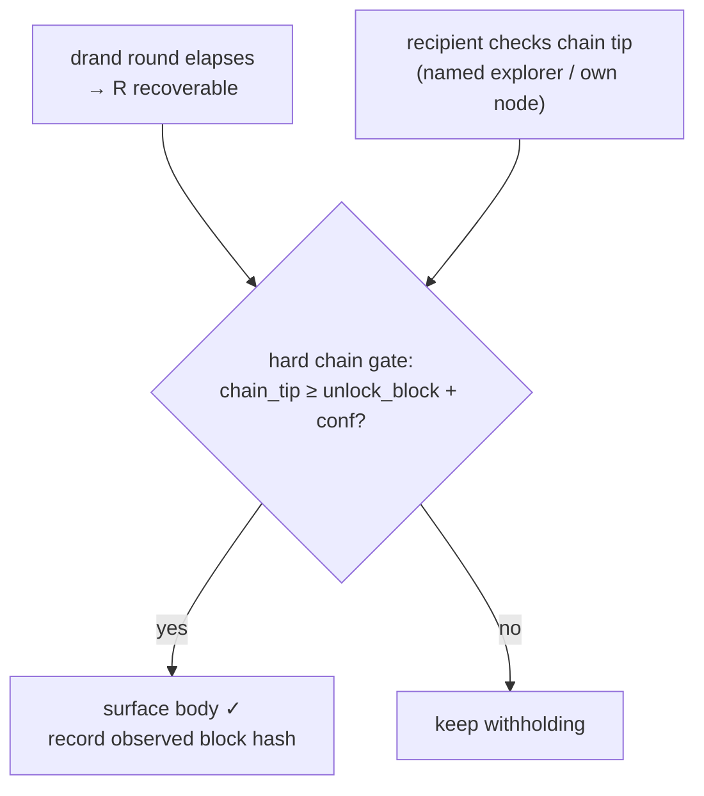

export const metadata = {
    title: 'Seal-til-block · OC Chat',
    description:
        'The block-height timelock mode: wrap a message key to a named beacon that releases it only after the Bitcoin chain passes block N. The v0 drand-tlock profile, the hard chain gate, redundant beacons, standing delivery (dead-man’s-switch), and the Ed25519 substitution test run out loud.',
};

# Seal-til-block

`seal-til-block` (`kind="chat-seal"` with a `seal` block) sends a message whose
contents become readable only **after the Bitcoin chain passes a future block
height**. The recipient receives the ciphertext immediately but holds no key
until then. This is the one mode that **fails the Ed25519 substitution test by
design** — and OC Chat says so, in writing, on every seal surface.

> **A v0 beacon seal is beacon-enforced, not Bitcoin-consensus-enforced.** The
> word "trustless" MUST NOT describe it. A colluding beacon threshold can
> release early; beacon disappearance permanently bricks the seal. A conforming
> client surfaces the beacon identity and these risks at compose time, and caps
> the v0 horizon at ~30 days.

## The trust posture, stated first

The seal's enforcement is a **threshold-BLS committee that watches a clock and
releases a key**. Swap "block height N" for "NTP timestamp T" and the machinery
is identical — this is literally drand/tlock, which is Bitcoin-independent. So:

- The BLS threshold is load-bearing for **enforcement**.
- Bitcoin block height is load-bearing only as the **predicate the committee
  voluntarily honors** — a _verified condition_, offline-checkable, never the
  lock.
- The Bitcoin claim of the **product** is carried by [speak-now](/chat/modes)'s
  BIP-322 identity and [pay-to-reach](/chat/postage)'s Lightning preimage —
  **never by the seal alone.**

[Why H5](/chat/why#the-ed25519-test-on-the-seal-out-loud) runs the test out
loud. We do not paper over it.

## The seal block

```json
"seal": {
  "unlock_block":    900000,
  "anchor":          "beacon",
  "beacon_id":       "drand:quicknet",
  "beacon_url":      "<https endpoint of the beacon>",
  "redundant_beacon": null,
  "confirmations":   6,
  "cltv_outpoint":   null
}
```

`seal` is committed in the `id`: changing `unlock_block` or any beacon field
changes the `id` and breaks the sender signature (the
[content-addressing rule](/chat/envelope)).

## What ships: the v0 in-ciphertext drand-tlock profile

The spec-pure path (a beacon _device_ re-wraps the key on authenticated release,
with `seal` as a committed top-level field) needs a `lock-core` change and is
the named **upgrade target**, not what v0 deploys. v0 deploys the
**in-ciphertext drand-tlock profile**, identical in shape to the
[postage carrier](/chat/postage):

- The readable `body` is the **empty string**. The real text is
  `AES-256-GCM(key = R, nonce, plaintext = text)` carried as `seal.locked_ct` +
  `seal.nonce`, where `R` is a fresh 32-byte reveal secret.
- `R` is **timelock-encrypted to a future drand round** (`seal.tlock`, an
  age-armored `tlock` blob), released by the named beacon `drand:quicknet` —
  **not** by an OC beacon device, and with **no OC re-wrap endpoint**. drand
  _is_ the beacon; anyone can decrypt `R` once the round's BLS signature
  publishes.
- The seal block rides **inside the encrypted payload**, so its integrity rests
  on the AEAD: the ciphertext is committed in the envelope `id` and
  device-signed, so tampering with `unlock_block` (or any seal field) breaks the
  signature.

The drand beacon is named in-envelope and in-UI as **"League of Entropy,
~12-of-22 BLS, NOT OC-controlled."** An earlier design claimed an "OC Fedimint
guardian federation" as the beacon — that was false (Fedimint's threshold crypto
signs funds custody, not threshold-_decryption_ of an external content key) and
was struck.

### The hard chain gate (NORMATIVE)

This is what makes the displayed promise honest. A conforming v0 recipient
**MUST NOT surface the body until it independently confirms
`chain_tip ≥ unlock_block + confirmations`** against a named explorer
(`chain_anchor`) or its own node — **even if `tlock` has already yielded `R`.**
A sealed message therefore opens at the **later** of (the drand round elapsing,
the chain reaching the height).



Reading the body early therefore requires **both** a drand-threshold collusion
**and** a non-conforming client. On release, the recipient SHOULD record the
observed block hash at `unlock_block` as an offline-verifiable receipt.

### Timing is approximate

The release round is derived from the target block via ~10 min/block, an
estimate whose std-dev is ≈ `10 min · sqrt(N_blocks)` — hours at weekly
horizons, unbounded worst case. The hard chain gate removes the **early** side
of that error on a conforming client (the body never surfaces before the real
height), so a sealed message can only open _later_ than the wall-clock estimate,
never materially earlier. The compose UI presents the **height** as the target
and labels the timing "approximate"; the released-message UI shows the **real
observed height + block hash**, not the estimate. (See
[Security S18](/chat/security).)

## Release (the re-wrap)

In the spec-pure path, after block `unlock_block + confirmations` confirms:

1. The recipient authenticates to the beacon over BIP-322 challenge-response.
2. The beacon verifies `chain_tip ≥ unlock_block + confirmations` against its
   own node (and, for a drand backend, that the corresponding round has
   elapsed).
3. The beacon unwraps `content_key` and re-wraps it for the recipient's device,
   returning a **detached `recipients[]` entry**.
4. The recipient merges the entry and decrypts. The `id` and ciphertext tag are
   unchanged — proven by vector `vc04`, the whole reason chat-kind `id`/AAD
   [exclude `recipients[]`](/chat/envelope#the-recipient-exclusion-rule-normative).

This is the **same re-wrap machinery as
[OC Lock payment mode](/lock/protocol)**, with the release predicate generalized
from "payment confirmed" to "block height reached." The recipient SHOULD
independently re-check `unlock_block` against their own node before trusting the
release.

## Redundant beacons — halves brick risk, doubles early-release surface

If `redundant_beacon` is set, `content_key` is escrowed independently to
**both** beacons so **either** release unlocks. This **halves brick risk but
doubles the early-release surface**: either committee can independently decrypt
the body early. A sealed message's UI MUST read **"readable early by
`{named quorum}`"**, not "unlocks at block N." Opt-in only, with the asymmetry
disclosed. (The drand `fastnet` sunset, which permanently bricked its
ciphertexts, is the cautionary precedent for why the hedge exists — and
[Security S3/S4](/chat/security) for its cost.)

## Standing delivery (dead-man's-switch)

A **standing delivery** is a _composition_ over the seal, not new crypto. The
author seals a message to a recipient with a **near** deadline, then **re-arms**
("checks in") before each deadline by re-sealing the **same** content to a
**later** `unlock_block` under a shared `standing_id` (a fresh CSPRNG id carried
**inside** the encrypted seal body, so relays never learn a switch exists). The
recipient groups seals by `standing_id` and treats only the **latest check-in —
the MAX `unlock_block`** — as live. Stop checking in → the last deadline passes
→ the message delivers. **The switch fires on silence.**

- **Safety of max-wins.** A relay can RAISE a group's max only by delivering a
  real, author-signed later check-in; it cannot forge one and cannot lower the
  max — so it can **never make the switch fire earlier** than the author's last
  real check-in. It CAN drop a fresh check-in — so a dead-man's-switch can be
  made to _fire_ but **not reliably suppressed** by a third party. That
  asymmetry is intended: a hostile party censoring your check-in is exactly when
  the switch should fire.
- **Horizon + cadence.** v0 inherits the ~30-day horizon cap, so a single arm is
  ≤ 4320 blocks out and a live standing delivery **requires a check-in at least
  every ~30 days**; a missed window IS the trigger.
- **Second check-in channel (RECOMMENDED).** An institutional deployment SHOULD
  arm a non-app check-in path so an app/relay outage is not a false trigger — a
  beacon outage could otherwise false-fire an irreversible disclosure
  ([Security S11](/chat/security)). v0 surfaces this in copy; it does not
  enforce it.

This is the one seal use case with real, repeat, high-stakes demand — and the
sharpest failure mode. Both are disclosed plainly.

## The reserved consensus path (CLTV-witness)

`anchor="cltv"` is **reserved, not shipped in v0**: `content_key` is committed
to a P2WSH output encumbered by `OP_CHECKLOCKTIMEVERIFY` at `unlock_block`;
spending after the height reveals the key in the witness, so any chain observer
extracts it — and **Bitcoin consensus is the enforcer.** `cltv_outpoint` carries
the outpoint. This is the structural upgrade path, pre-wired so it can land
**without a format break**. A deployment MUST NOT advertise it as available
until a conformance vector and a browser-shippable witness-extraction build
exist.

## Next

- [The three send modes](/chat/modes) — where seal-til-block sits.
- [Security posture](/chat/security) — S2–S5, S11, S13, S18 (the seal's named
  gaps).
- [Why OC Chat](/chat/why) — the seal rationale and the Ed25519 verdict in full.
