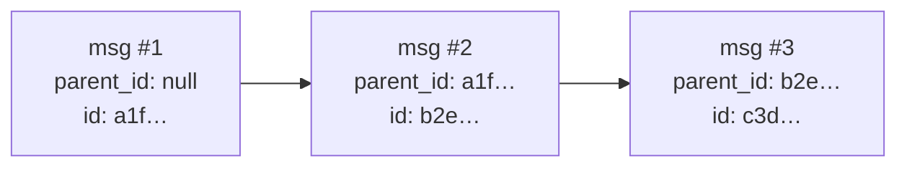

export const metadata = {
    title: 'Threading & attachments · OC Chat',
    description:
        'How OC Chat orders a conversation: thread state lives inside the encrypted payload as a parent_id hash-chain, never the plaintext created_at. Plus end-to-end-encrypted inline attachments and the blob-store upgrade.',
};

# Threading & attachments

Thread state in OC Chat lives **inside the encrypted payload**, never the
plaintext envelope. A relay learns nothing about which conversation a message
belongs to or what order it falls in — and the recipient gets cryptographic
tamper-evidence for free.

## The encrypted payload

The decrypted payload of a chat envelope is UTF-8 JSON:

```json
{
    "body": "<message text or a typed structure>",
    "conversation_id": "<stable thread label>",
    "seq": 1,
    "parent_id": "<chat_envelope_id of the parent message, or null for the first>",
    "recv_queue": "<optional; base64url; my durable-inbox queue_id for this conversation>"
}
```

### `conversation_id` — a stable thread label

`conversation_id` is a stable label requiring no negotiation. The RECOMMENDED
default is `SHA-256` of the two Bitcoin addresses sorted ascending and joined
with `:` — a deterministic 1:1 thread id both sides compute independently.

### `parent_id` — the hash-chain

**`parent_id` MUST equal the `chat_envelope_id` of the message it replies to**
(or `null` for the first in a thread). This makes each thread a verifiable
**hash-chain**:

- A client MUST order and validate by the `parent_id` chain.
- A client MUST NOT trust `created_at` for ordering — it is plaintext,
  minute-rounded, and relay-influenceable.
- A missing parent is a **detectable gap** (`E_THREAD_GAP`).



This gives per-thread **tamper-evidence**. It is **not** a transport-layer
anti-replay or anti-reorder guarantee: a relay can still withhold or delay
delivery (see [Security S10](/chat/security)). The hash-chain detects tampering
and gaps; it does not force a hostile relay to deliver.

> This is the [old lock chat's `created_at` sort](/lock/chat#thread-identity)
> replaced with a cryptographic chain. It is the only anti-reorder primitive
> available without a Signal-style ratchet, which v0 deliberately does not
> implement ([Why](/chat/why#what-we-still-dont-have)).

### `recv_queue` — the durable-inbox handshake

`recv_queue` is optional. It advertises the sender's own per-conversation
[durable-inbox queue id](/chat/transport#durable-inbox) so the peer routes
future deposits there instead of the bootstrap queue. It rides **inside** the
AEAD-sealed payload, so the inbox operator never learns the bootstrap ↔
per-conversation mapping. A client that omits it simply keeps using the
bootstrap queue.

## Attachments — end-to-end-encrypted

A message MAY carry a file via an optional `attachment` field in the payload:

```json
"attachment": {
  "name": "<file name>",
  "type": "<MIME>",
  "size": 12345,
  "data": "<base64 of the raw bytes>"
}
```

Because the **whole** payload is AES-256-GCM-sealed to each recipient device —
the same envelope as the text — the file is **end-to-end encrypted and
tamper-evident**:

- No server — relay or durable inbox — ever holds a plaintext file.
- Altering the file breaks the content-addressed `id` and the device signature.

### The inline v0 profile

The bytes ride **in the ciphertext**, so the file size is bounded to what fits a
gift-wrap event. The reference client caps inline attachments at **~100 KiB
raw**. The recipient validates the parsed `attachment` shape and size
**defensively** even though the AEAD already authenticates it — untrusted MIME
on a `data:`/blob URL is an [XSS class](/chat/security) the client sanitizes to
a raster allowlist before rendering.

### The blob-store upgrade (not v0)

Larger files use a blob-store profile: encrypt the file under a fresh per-file
key, upload the **ciphertext** blob out-of-band to a store that sees only
ciphertext, and carry `{ blob_ref, key, nonce }` inside the sealed payload so
only the recipient can fetch and decrypt. This removes the inline size cap while
keeping the no-plaintext-on-a-server invariant. It is the named upgrade path,
not shipped in v0.

## Channel posts order differently

A public [channel](/chat/channels) is fan-out, not a two-party chain, so it
relaxes this rule: a top-level post sets `parent_id: null` and the feed is
ordered by the event `created_at` as a **display hint, tie-broken by the
content-addressed `post_id`** so any two clients agree. `created_at` is still
untrusted; the `post_id` tiebreak makes the order stable and reproducible. A
non-null `parent_id` threads an explicit reply under its parent. This relaxation
applies **only** to channels — DMs keep the strict single-chain rule above.

## Next

- [Transport & durable inbox](/chat/transport) — how a message travels and how
  the durable queue retains it.
- [Envelope & content addressing](/chat/envelope) — how `chat_envelope_id` is
  computed.
- [Channels](/chat/channels) — the fan-out ordering rule in full.
