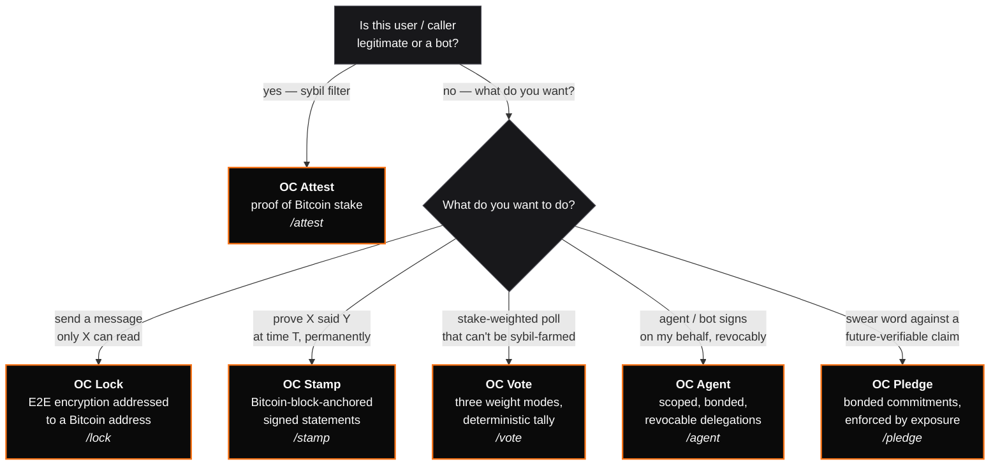

export const metadata = {
    title: 'Which protocol do I need?',
    description:
        'A short decision tree across OC Attest, Lock, Stamp, Vote, and Agent. Pick the right starting point in under a minute.',
};

# Which protocol do I need?

A short decision tree. None of these are mutually exclusive — most real
deployments compose two or three. But start with exactly one.

## Decision tree

## Match by use case

| You're building…                                                             | Pick                                                                             |
| ---------------------------------------------------------------------------- | -------------------------------------------------------------------------------- |
| A forum, Nostr relay, airdrop allowlist, dApp gate                           | **OC Attest**                                                                    |
| A dead-drop / sealed-message box addressed to a BTC address                  | **OC Lock**                                                                      |
| A commit / release signing flow with durable provenance                      | **OC Stamp**                                                                     |
| A DAO proposal vote with stake × time weighting                              | **OC Vote**                                                                      |
| Delegated signing for an automated pipeline or autonomous bot                | **OC Agent** (scoped, bonded, revocable)                                         |
| A research preregistration / public commitment with bonded stake             | **OC Pledge**                                                                    |
| An SLA promise with cryptographic resolution and reputational consequence    | **OC Pledge** (resolves via OC Stamp `stamp_published`)                          |
| An open-source delivery commitment tied to a Bitcoin block height            | **OC Pledge** (resolves via on-chain block-height oracle)                        |
| A social network where posts are cryptographically bound to Bitcoin identity | **OC Attest + OC Lock**                                                          |
| A governance portal where votes are public + weighted by stake               | **OC Vote + OC Attest** (Attest gates who can vote; Vote weights what they cast) |
| An archive whose entries prove both authorship and timestamp                 | **OC Stamp** (authorship via BIP-322, time via OTS anchor)                       |
| A skin-in-the-game prediction with public exposure on broken word            | **OC Pledge + OC Attest** (Attest is the bond; Pledge is the claim)              |

## Common patterns

### Attest as the floor

Most deployments use **OC Attest** as a cheap entry gate (e.g. 10 000 sats for
30 days) and then layer a domain-specific protocol on top. The Attest proof
filters bots at the door; the upstream protocol handles the actual workflow.

### Stamp + Attest

An OC Stamp envelope can optionally embed an OC Attest `attestation_id` as a
"stake at signing" signal. This lets anyone verifying the stamp also see how
much stake the signer held at the moment they signed — useful for review sites,
audit trails, and reputation systems.

### Vote + Attest

OC Vote's `sats_days` weight mode resolves voter weight directly from the
signer's Bitcoin UTXOs, which is an Attest-adjacent concept. You don't need an
Attest attestation to run a Vote poll — but if you want to gate _who can cast a
ballot at all_, Attest is the door.

### Pledge + Attest

A Pledge's bond _is_ an Attest reference — `bond.attestation_id` points at the
sats × days the pledger has staked behind their word. There is no Pledge
without Attest. Threshold the bond minimum to filter cheap commitments.

### Pledge + Stamp

The canonical pledge-resolution mechanism is `stamp_published`: the pledger
satisfies the claim by publishing an OC Stamp envelope that matches a
declared content predicate before the deadline. Pledge writes the contract,
Stamp closes it.

### Pledge + Vote

When a pledge's outcome is contested (e.g. "did the deliverable ship on time
and to spec?"), the dispute mechanism can be a stake-weighted OC Vote poll
with the pledger and counterparty bonded. The tally settles the pledge.

## If this still doesn't fit

OrangeCheck isn't the right tool for:

- **Proof of personhood / unique-human guarantees.** None of these protocols
  prove that a BTC address maps to a unique human. Use
  [Worldcoin / World ID](https://worldcoin.org),
  [BrightID](https://brightid.org), or similar.
- **Private / zero-knowledge stake proofs.** Every OrangeCheck proof is public
  by design. For privacy-preserving stake signals, look at Sismo or zkBadges.
- **Generic KYC / compliance.** None of these protocols collect or verify
  personal information. They prove cryptographic facts about Bitcoin UTXOs and
  signatures.
