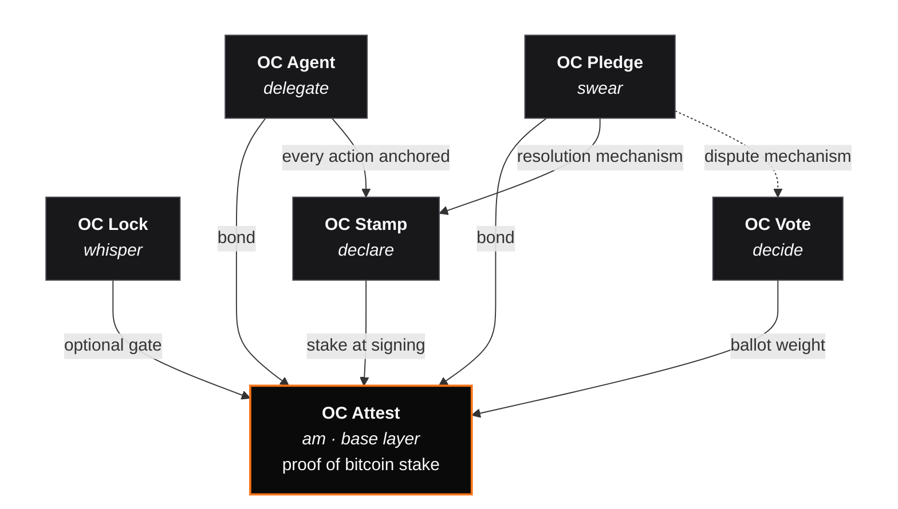

export const metadata = {
    title: 'OrangeCheck documentation',
    description:
        'Unified docs for the OrangeCheck ecosystem — OC Attest, OC Lock, OC Stamp, OC Vote, OC Agent, OC Pledge. Shared concepts up top, protocol-specific sections below.',
};

# Overview

**OrangeCheck** is a family of Bitcoin-stake primitives for the open web. These
docs cover the whole family — shared plumbing up top, then one dedicated section
per protocol. Everything links back to the same canonical message format, same
BIP-322 signing primitive, same Nostr kind-30078 conventions. Learn the shared
layer once; each protocol adds a small sibling-specific layer on top.

## The family

Six verbs of sovereign sociality: _am, whisper, decide, declare, delegate,
swear_.

| Protocol                 | Verb     | What it does                                                                                                                      | Status |
| ------------------------ | -------- | --------------------------------------------------------------------------------------------------------------------------------- | ------ |
| **[OC Attest](/attest)** | am       | Sybil resistance via proof of Bitcoin stake. Sign one message; any verifier can check that you've held N sats for N days.         | live   |
| **[OC Lock](/lock)**     | whisper  | End-to-end encryption addressed to a Bitcoin address. Sealed envelopes that only the key-holder of a specific address can unseal. | live   |
| **[OC Vote](/vote)**     | decide   | Stake-weighted sybil-resistant polls. Three canonical weight modes. Deterministic, cross-impl-testable tally.                     | live   |
| **[OC Stamp](/stamp)**   | declare  | Bitcoin-block-anchored signed statements. BIP-322 + OpenTimestamps. Immutable authorship + priority.                              | live   |
| **[OC Agent](/agent)**   | delegate | Bitcoin-identity-bound delegation authority. Scoped rights, bonded to sats, revocable on-demand. Every agent action is signed.    | live   |
| **[OC Pledge](/pledge)** | swear    | Forward-looking commitment primitive. BIP-322-signed declarations about future-verifiable propositions, bonded to an OC Attest.   | live   |

OC Attest is the **base layer** — every other sibling can optionally reference
an Attest proof as a "stake at signing" signal. The other five siblings are
**peers**: none depends on the others at the protocol level.

## How they compose

Eight real composition arrows across six protocols: every peer can pin its
artifacts to Attest stake; Pledge resolves through Stamp and disputes through
Vote; every Agent action is itself a Stamp. None of these compositions is
required — but each one is what turns six small protocols into a single
substrate.

## How these docs are organized

- **[Getting started](/getting-started/which-protocol)** — land here first.
  Decision tree across the six protocols, plus a running integration in under
  five minutes.
- **[Ecosystem](/ecosystem)** — the plumbing every protocol inherits. The
  canonical message format, BIP-322 signing, Nostr kind-30078, conformance
  vectors, and the shared security model. Written once; never duplicated.
- **Per-protocol sections** — one each for Attest, Lock, Stamp, Vote, Agent,
  Pledge. Each follows the same shape: overview → how it works → concepts → API
  → guides. Pattern-match once; navigate them all.
- **[SDKs](/sdks)** — every published `@orangecheck/*` package, mapped to which
  protocol it serves.
- **[Reference](/reference/faq)** — FAQ and glossary.

## Where the authoritative bits live

|                           | Repo                                                                                                         |
| ------------------------- | ------------------------------------------------------------------------------------------------------------ |
| Canonical protocol spec   | [`oc-protocol`](https://github.com/orangecheck/oc-attest-protocol) (CC-BY-4.0)                               |
| Reference implementations | [`oc-packages`](https://github.com/orangecheck/oc-packages) (MIT) — one monorepo for every published package |
| OC Lock spec              | [`oc-lock-protocol`](https://github.com/orangecheck/oc-lock-protocol)                                        |
| OC Stamp spec             | [`oc-stamp-protocol`](https://github.com/orangecheck/oc-stamp-protocol)                                      |
| OC Vote spec              | [`oc-vote-protocol`](https://github.com/orangecheck/oc-vote-protocol)                                        |
| OC Agent spec             | [`oc-agent-protocol`](https://github.com/orangecheck/oc-agent-protocol)                                      |
| OC Pledge spec            | [`oc-pledge-protocol`](https://github.com/orangecheck/oc-pledge-protocol)                                    |
| This site                 | `oc-docs`                                                                                                    |

## Conventions

- Short code snippets are runnable as-is. Longer ones link to a full working
  example in
  [`oc-packages/EXAMPLES.md`](https://github.com/orangecheck/oc-packages/blob/main/EXAMPLES.md).
- "Attestation" (lowercase) refers specifically to an **OC Attest** signed
  proof. Lock envelopes, Stamp envelopes, Vote ballots, etc. are not called
  attestations.
- Every protocol ships a spec repo and a reference impl. If the two disagree,
  **the spec is authoritative** and the impl is the bug.

## Start somewhere

- [**Which protocol do I need?**](/getting-started/which-protocol) — 60-second
  decision tree
- [**Quickstart**](/getting-started/quickstart) — ship an integration in 5
  minutes
- [**Ecosystem concepts**](/ecosystem) — learn the shared layer once
- [**OC Attest overview**](/attest) — the base-layer protocol
