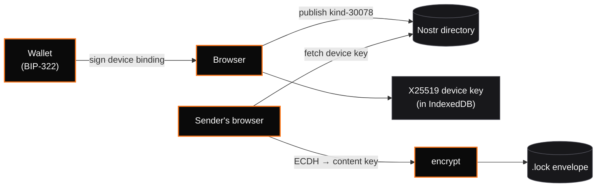

export const metadata = {
    title: 'Protocol walkthrough · OC Lock',
    description: 'Identity mode, payment mode, multi-device, self-vaults — with flow diagrams.',
};

# Protocol walkthrough

This is a narrative companion to the [specification](/lock/spec). If you want the normative rules, read the spec. If you want to understand *why* and *how*, read this.

## The problem

> "I want to send Alice an encrypted message, and I want to prove to her it's from me, and I want to know that only she — specifically, the holder of her Bitcoin address — can open it."

That is the user story OC Lock serves. Every Bitcoin-native attempt at solving it has failed on UX:

- **PGP** — works, but requires key management mastery.
- **LOCK v1 (adaptor signatures)** — elegant on paper; no browser-compatible WASM library ever shipped.
- **LOCK v1.1 (Proof-of-Access)** — dropped adaptor signatures but kept every vault creation and unlock as a Bitcoin transaction.

v2 makes the boring choice: **treat Bitcoin as an identity system, not an access-control oracle**. The chain proves who owns what address; the encryption is plain old authenticated public-key crypto.

## The mental model



Every user does exactly one "hard" thing, only once: sign a BIP-322 message that binds a browser-generated X25519 key to their Bitcoin address. After that, sending and receiving are one click.

## Flow 1 — Alice sends Bob a message (identity mode)

**Bob's one-time setup:**

1. Bob visits the app.
2. He enters his Bitcoin address.
3. The browser generates an X25519 keypair. The secret stays in IndexedDB.
4. The browser builds the binding statement:

    ```
    oc-lock:device-bind:v2
    address: bc1qbob…
    device_pk: 7d2f…
    device_id: a8b4…
    created_at: 2026-04-22T14:03:11Z
    ```

5. Bob's wallet signs it with BIP-322 (one prompt, one click).
6. The browser publishes a Nostr kind-30078 event containing the statement, pubkey, and signature. The `d` tag is `oc-lock:device:bc1qbob…` — anyone can find it by Bitcoin address.

Bob is now **addressable**.

**Alice sends:**

1. Alice types Bob's address.
2. The app fetches Bob's device record from Nostr and verifies the binding BIP-322 signature against `bc1qbob…`.
3. Alice writes her message.
4. The app generates a random `content_key`, encrypts the payload with AES-256-GCM, then for each recipient device: generates an ephemeral X25519 keypair, derives `shared = ECDH(eph_sk, device_pk)`, wraps the content key under `HKDF(shared, salt=nonce_ct)`.
5. Alice signs the envelope with her wallet (BIP-322 over the envelope id).
6. The envelope is a JSON object. Alice copies the share link.

**Bob receives:**

1. Bob opens the link.
2. The app recomputes the envelope id and verifies Alice's signature.
3. Finds Bob's `device_id` in `recipients[]`.
4. `shared = X25519(device_sk, eph_pk)` → unwrap content key → decrypt payload.
5. Plaintext shown. < 3 seconds.

No Bitcoin transaction was made. The chain proved only that Bob controls his address and Alice controls hers.

## Flow 2 — Alice sells Bob a file (payment mode)

Sometimes you want Bitcoin to do more than identity: you want "10k sats gets you this." Payment mode is how.

Alice runs (or trusts) a **relay**: a minimal web service that holds content keys on behalf of vaults and releases them upon observing confirmed payments. The relay has a long-lived X25519 device key. Its URL and pubkey are public.

**Alice creates a payment-gated vault:**

1. Chooses payment-gated. Sets amount = 10,000 sats, payment address = her `bc1qalice…`, relay URL, confirmations = 1.
2. The app wraps the content key for the **relay's** device key.
3. Alice signs the envelope with her wallet and shares the link.

**Bob unlocks:**

1. Opens the link. The app shows price + relay URL.
2. Bob pays 10k sats to `bc1qalice…`.
3. Bob authenticates to the relay via OrangeCheck sign-in.
4. App submits `{ envelope_id, tx_id }` to the relay.
5. Relay verifies the tx (amount, confirmations, recipient), unwraps the content key with its own device secret, re-wraps it for Bob's device key fetched from Nostr, returns the new recipient entry.
6. Bob's app decrypts normally.

The relay is a trust anchor. Its URL is always visible, anyone can run one, and future versions may replace it with DLC oracles or BIP-118 covenants.

## Flow 3 — Multi-device and rotation

Bob has a laptop and a phone. Each browser has its own device key. On first sign-in, each publishes a separate Nostr record with its own `device_id`. Senders fetching Bob's records get a list; they encrypt once per active device.

**To rotate:** Bob generates a new device secret, signs a new binding statement, publishes a replacement event (Nostr kind 30078 is addressable — same `d` tag overwrites). Old envelopes addressed to the old `device_pk` are unreadable from the new device.

**To revoke:** Bob publishes an event with `device_pk=revoked`. Conforming senders refuse to encrypt to revoked records.

## Flow 4 — Self-vault (password manager pattern)

Alice can seal a vault to herself. Sender and recipient are both her Bitcoin address. The envelope's only `recipients[]` entry is her own device record. She can decrypt from any of her devices. The "password" is her Bitcoin wallet.

## Layered with OrangeCheck

OC Lock depends on OrangeCheck in two explicit places:

1. **Sybil-gated inbox** (optional). Call `@orangecheck/sdk#check` on the recipient's address before encrypting. Require minimum sats / minimum days.
2. **Shared sign-in.** OC Lock's payment-mode relay uses OrangeCheck's sign-in-with-bitcoin flow verbatim: BIP-322 challenge, signed response, JWT session. Same wallet signs binding statements and OC challenges.

Every OC Lock device record is structurally similar to an OrangeCheck attestation: a canonical UTF-8 message committing to a Bitcoin address, BIP-322-signed. Attestation ids (SHA-256 of canonical message) are computable over the binding statement for stable, content-addressable discovery.

## Anti-patterns we rejected

- **Browser-wallet ECDH.** Bitcoin wallets don't expose ECDH. Nostr wallets do (NIP-04/44), but we don't want to require a Nostr-native wallet. The device-key pattern sidesteps this.
- **Deriving decryption keys from BIP-322 signatures.** Schnorr BIP-340 and RFC-6979 ECDSA are deterministic, so a fixed-message signature could seed a KDF. But wallet implementations vary. We don't rely on it.
- **Full Signal-protocol double ratchet.** Overkill for one-shot message drops; the state-sync cost conflicts with "no server" default.
- **Server-mandatory storage.** Every envelope is self-contained. Export to a QR code, paper, USB, or IPFS.

## Where to go next

- [Specification](/lock/spec) — byte-level rules.
- [Why v2](/lock/why) — the v1 postmortem.
- [FAQ](/reference/faq) — common questions.
