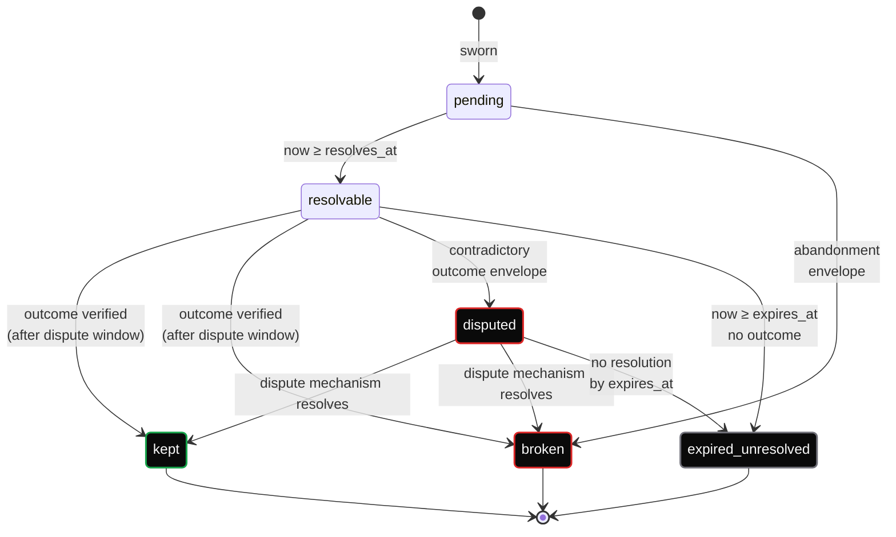

export const metadata = {
    title: 'OC Pledge — State machine',
    description:
        'Every pledge is in one of six states. Transitions are pure functions of (envelope, outcome, time, public state). Two verifiers with the same inputs produce the same classification.',
};

# State machine

Every pledge is in **exactly one** of these states at any given time:

| State                | Meaning                                                                   |
| -------------------- | ------------------------------------------------------------------------- |
| `pending`            | Sworn, before `resolves_at`.                                              |
| `resolvable`         | Past `resolves_at`, within `expires_at`, no outcome published yet.        |
| `kept`               | Outcome published, outcome = kept, dispute window passed.                 |
| `broken`             | Outcome published, outcome = broken, dispute window passed.               |
| `disputed`           | Contradictory outcome envelopes within dispute window — pending dispute.  |
| `expired_unresolved` | Past `expires_at` with no consistent outcome.                             |

State transitions are **pure functions** of `(pledge envelope, outcome
envelope or absence, current time, relevant public state)`. Two verifiers
with the same inputs produce the same classification. This is a
**conformance requirement** — disagreement on state is a protocol bug.

## Transitions

**Abandonment counts as broken** — there is no separate abandoned state.
Refusing the "honorable exit" classification preempts the
race-to-abandon attack where swearers dodge a foreseeable break by
admitting it slightly earlier.

## What "verified" means in `resolvable → kept|broken`

For deterministic mechanisms (`chain_state`, `nostr_event_exists`,
`stamp_published`, `http_get_hash`, `dns_record`): the verifier
re-computes the outcome envelope from public state. Byte-equal to the
published one ⇒ verified.

For `counterparty_signs` and `vote_resolves`: BIP-322 signature checks
under the resolver address; for `vote_resolves`, the named poll must
have a finalized tally meeting the pledge's threshold.

## Bond verification at every transition

A pledge with a bond reference whose underlying OC Attest UTXO is spent
mid-pledge is **not** auto-reclassified by the protocol — that's a
verifier-policy decision (see
[SPEC §8](https://github.com/orangecheck/oc-pledge-protocol/blob/main/SPEC.md)).
The protocol surfaces `E_BOND_SPENT` as an error code; an integrator
choosing strict policy treats a spent bond as an automatic break, while a
lenient one treats it as informational. Refusing automatic
reclassification preserves the
[no-slashing rule](/pledge/enforcement-by-exposure) — the protocol never
*does* anything to a swearer's status; it only *exposes* the facts.

## Dispute window

For deterministic outcomes the dispute window is short (default 24 hours)
because contradiction is unlikely — if two observers reach different
outcomes for the same public state, at least one is buggy. For
`counterparty_signs` it's longer (default 7 days) because contradiction
is the expected disagreement mode and the pledge's `dispute.mechanism`
needs time to resolve.

The dispute window length is a per-pledge field, not a global default.
Swearers choose at swearing time.

## The `expired_unresolved` class is intentional

A pledge with no outcome by `expires_at` is **not** automatically broken.
It's a third outcome class, queryable separately. The reason: a pledge
with `counterparty_signs` resolution where the counterparty just never
shows up is informational about *the counterparty's* behavior, not the
swearer's. Conflating it with `broken` would let lazy counterparties
break pledges by silence.

Verifiers building gates can compose any policy they want — count
`expired_unresolved` as broken for one address class, ignore it for
another. The protocol surfaces the raw fact.
